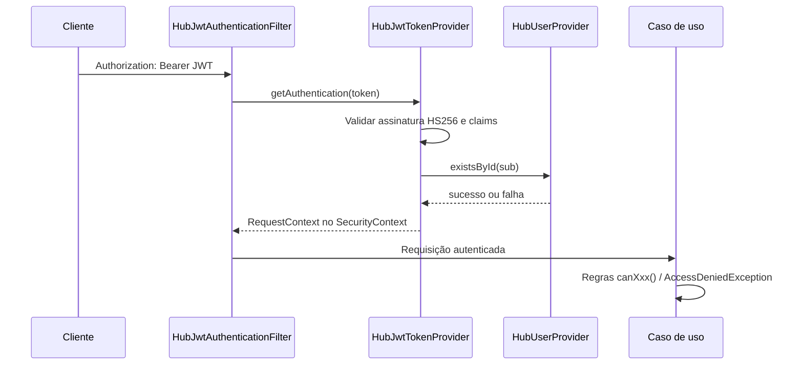

<h1 align="center">
   Checklist API
</h1>

<p align="center">
  
</p>

<br> 

API REST em **Spring Boot** do ecossistema **Portal Conecta**. Responsável por **modelos de checklist (templates)**, **execuções** (rascunho, envio e cancelamento), **respostas**, **cálculo de conformidade** e **pendências** geradas a partir de itens não conformes.

A autenticação é centralizada no **Hub**. Este serviço valida o JWT do Hub localmente, aplica regras de autorização do módulo Checklist e persiste apenas dados de domínio próprios. Usuários, turmas, salas e permissões globais permanecem no Hub.

---

## Índice

1. [Visão geral](#visão-geral)
2. [Stack tecnológica](#stack-tecnológica)
3. [Arquitetura](#arquitetura)
4. [Modelo de dados](#modelo-de-dados)
5. [Regras de negócio](#regras-de-negócio)
6. [Autenticação e autorização](#autenticação-e-autorização)
7. [Referência da API REST](#referência-da-api-rest)
8. [Tratamento de erros](#tratamento-de-erros)
9. [Configuração e perfis](#configuração-e-perfis)
10. [Ambiente de desenvolvimento local](#ambiente-de-desenvolvimento-local)
11. [Documentação interativa (OpenAPI)](#documentação-interativa-openapi)
12. [Testes e integração contínua](#testes-e-integração-contínua)
13. [Integração com o Hub](#integração-com-o-hub)
14. [Testes manuais (Postman)](#testes-manuais-postman)
15. [Diretrizes de desenvolvimento](#diretrizes-de-desenvolvimento)
16. [Decisões pendentes](#decisões-pendentes)

---

## Visão geral

| Aspecto | Descrição |
|--------|-----------|
| **Artefato Maven** | `com.portal:conecta.checklist` |
| **Versão** | `0.0.1-SNAPSHOT` |
| **Java** | 21 |
| **Porta padrão** | `8083` (`SERVER_PORT`) |
| **Banco de dados** | PostgreSQL 16 |
| **Prefixo da API** | `/api` |

### Dados que este serviço armazena

- Modelos de checklist por sala (`checklist_template`)
- Execuções de checklist (`checklist_execution`)
- Respostas em JSON (`answers_json`)
- Pontuação de conformidade (`compliance_score`)
- Pendências vinculadas à execução (`checklist_issue`)

### Dados que pertencem ao Hub (fora do escopo desta API)

- Usuários, turmas, cursos e salas
- Emissão e revogação de tokens
- Permissões globais da plataforma

---

## Stack tecnológica

| Tecnologia | Uso |
|------------|-----|
| **Spring Boot 4.0.6** | Framework principal |
| **Spring Web MVC** | API REST |
| **Spring Data JPA** | Persistência |
| **Spring Security** | Filtro JWT sem estado (stateless) |
| **Spring Validation** | Validação dos DTOs |
| **Spring Actuator** | Endpoints de saúde e informações |
| **PostgreSQL** | Banco em produção e desenvolvimento local |
| **H2** | Banco em memória nos testes automatizados |
| **Springdoc OpenAPI 3.0.2** | Interface Swagger e `/v3/api-docs` |
| **JJWT 0.12.6** | Validação HS256 do token do Hub |
| **Lombok** | Redução de código repetitivo |
| **JUnit 5 + Mockito** | Testes unitários |
| **Docker Compose** | PostgreSQL local |
| **Maven** | Compilação e gerenciamento de dependências |

A integração HTTP com o Hub usa **`RestClient`** (implementações em `shared/hub/provider`). No desenvolvimento, o perfil **`mock`** substitui as chamadas externas por validação em memória.

---

## Arquitetura

Organização por **módulos de negócio** e camadas dentro de cada módulo.

```text
src/main/java/com/portal/conecta/checklist/
├── Application.java
├── module/
│   ├── checklist/
│   │   ├── domain/           # Entidades, enums, objetos de valor
│   │   ├── application/      # Casos de uso, fachadas, mapeadores de comando
│   │   ├── presentation/     # Controladores, DTOs, mapeadores de resposta
│   │   └── infrastructure/   # Repositórios JPA
│   └── issues/
│       ├── domain/
│       ├── presentation/     # DTOs de resposta (sem controlador próprio no MVP)
│       └── infrastructure/
└── shared/
    ├── config/               # Jackson, RestClient, EnvFileLoader
    ├── context/              # RequestContext (usuário autenticado)
    ├── exception/            # GlobalHandlerException
    ├── hub/                  # Provedores do Hub (HTTP e simulado)
    └── security/             # Filtro JWT, SecurityConfig
```

### Camadas e responsabilidades

| Camada | Responsabilidade |
|--------|------------------|
| **presentation** | HTTP, validação de entrada (`@Valid`), conversão para DTOs |
| **application** | Orquestração: casos de uso, fachadas, transações |
| **domain** | Modelo e enums; sem dependência de Spring/JPA quando possível |
| **infrastructure** | JPA, consultas, clientes HTTP para o Hub |
| **shared** | Segurança, contexto da requisição, exceções globais, configuração |

Os controladores permanecem enxutos: delegam para **fachadas**, que chamam **casos de uso**.

---

## Modelo de dados

### `checklist_template`

| Campo | Tipo | Descrição |
|-------|------|-----------|
| `id` | UUID | Identificador |
| `room_id` | UUID | Sala no Hub |
| `title` | texto (150) | Título |
| `description` | texto (250) | Descrição |
| `version` | inteiro | Versão do modelo |
| `status` | enum | `DRAFT`, `ACTIVE`, `INACTIVE` |
| `active` | booleano | Indicador legado/alinhado ao status |
| `schema_json` | JSONB | Estrutura de seções e itens |
| `created_at` | instante | Data de criação |
| `updated_at` | instante | Última atualização |

### `checklist_execution`

| Campo | Tipo | Descrição |
|-------|------|-----------|
| `id` | UUID | Identificador |
| `checklist_template_id` | UUID | Modelo utilizado |
| `room_id` | UUID | Sala |
| `class_id` | UUID | Turma |
| `user_id` | UUID | Usuário que criou (claim `sub` do token) |
| `status` | enum | `DRAFT`, `SUBMITTED`, `CANCELED` |
| `answers_json` | JSONB | Respostas após o envio |
| `compliance_score` | decimal(5,2) | Percentual de itens conformes |
| `checklist_type` | enum | `ARRIVAL`, `DEPARTURE` |
| `period` | enum | `MORNING`, `AFTERNOON`, `NIGHT` |
| `started_at` | data/hora | Início do rascunho |
| `submitted_at` | data/hora | Momento do envio (quando `SUBMITTED`) |

### `checklist_issue`

Gerada automaticamente no envio para cada resposta `NON_COMPLIANT`.

| Campo | Tipo | Descrição |
|-------|------|-----------|
| `id` | UUID | Identificador |
| `checklist_execution_id` | UUID | Execução de origem |
| `assigned_user_id` | UUID | Responsável (criador da execução) |
| `item_key` | texto | Chave do item no esquema |
| `item_title_snapshot` | texto | Título do item no momento do envio |
| `title` | texto | Título da pendência |
| `description` | texto | Observação informada no envio |
| `status` | enum | Inicial: `OPEN` |
| `priority` | enum | Inicial: `MEDIUM` |
| `due_at` | instante | Prazo (+7 dias após o envio) |
| `resolved_at` | instante | Data de resolução (evolução futura) |

### Esquema do modelo (`schemaJson`)

```json
{
  "sections": [
    {
      "key": "estrutura",
      "title": "Estrutura",
      "order": 1,
      "items": [
        {
          "key": "quadro",
          "title": "Quadro em bom estado?",
          "description": "Verificar quadro",
          "required": true,
          "order": 1
        }
      ]
    }
  ]
}
```

As chaves de seção e de item devem ser **únicas** em todo o esquema.

---

## Regras de negócio

### Modelos (templates)

- Apenas usuários com `userType` **`SENAI`** ou **`WEG`** no token podem **criar** e **ativar** modelos.
- A sala (`roomId`) deve existir no Hub.
- Ao **ativar** um modelo, os demais modelos **ativos da mesma sala** passam para `INACTIVE`.
- Listagem e consulta por ID exigem acesso ao módulo Checklist (ver [autorização por ação](#autorização-por-ação)).

### Execuções (rascunho)

- O modelo deve estar **`ACTIVE`** e o `roomId` da requisição deve coincidir com o do modelo.
- Sala e turma são validadas no Hub (`HubRoomProvider`, `HubClassProvider`).
- O usuário precisa ser **`REPRESENTATIVE`** ou **`TEACHER`** na turma informada (`classes[].role` no token).
- **Unicidade:** não pode existir outra execução no mesmo dia para a mesma combinação de `classId`, `roomId`, `period` e `checklistType`.
- O `user_id` da execução é sempre o `sub` do token (não é informado no corpo da requisição).

### Envio (submit)

- Apenas execuções em **`DRAFT`** podem ser enviadas.
- Apenas o **criador** da execução pode enviá-la.
- Todos os itens com **`required: true`** no esquema devem ter resposta.
- Cada `itemKey` das respostas deve existir no modelo; respostas duplicadas são rejeitadas.
- `COMPLIANT`: observação opcional.
- `NON_COMPLIANT`: **observação obrigatória**.
- **Conformidade:** `(itens COMPLIANT ÷ itens respondidos) × 100`, com 2 casas decimais.
- Cada `NON_COMPLIANT` gera uma **pendência** com status `OPEN`, prioridade `MEDIUM` e vencimento em **7 dias**.

### Cancelamento

- Apenas execuções **`SUBMITTED`** podem ser canceladas (`status` → `CANCELED`).
- No caso de uso atual não há verificação explícita de perfil (apenas autenticação).

---

## Autenticação e autorização

### Fluxo



### Cabeçalho obrigatório (rotas protegidas)

```http
Authorization: Bearer <jwt-do-hub>
```

O usuário atuante **nunca** é informado via `userId` no caminho ou no corpo: sempre obtido do claim `sub`.

### Claims esperadas no JWT

```json
{
  "jti": "abc-xyz-789",
  "sub": "11111111-1111-1111-1111-111111111111",
  "userType": "REPRESENTATIVE",
  "classes": [
    {
      "classId": "22222222-2222-2222-2222-222222222222",
      "role": "REPRESENTATIVE"
    }
  ],
  "iat": 1710000000,
  "exp": 1710003600
}
```

| Claim | Obrigatória | Regras |
|-------|-------------|--------|
| `jti` | Sim | UUID |
| `sub` | Sim | UUID do usuário |
| `userType` | Sim | `STUDENT`, `REPRESENTATIVE`, `TEACHER`, `SENAI`, `WEG`, `ADMIN` |
| `classes` | Não | Lista; cada item: `classId` (UUID), `role` (`STUDENT`, `TEACHER`, `REPRESENTATIVE`) |
| `iat` | Sim | Data de emissão |
| `exp` | Sim | Data de expiração |

Validação local com **`JWT_SECRET`** (Base64, mesma chave HS256 do Hub). Após a leitura do token, o usuário deve existir no Hub (`HubUserProvider`).

> O Hub ainda não emite `permissionVersion`. Se isso for adicionado, será tratado como evolução de integração separada.

### Perfis globais (`userType`)

| Perfil | Acesso operacional ao Checklist |
|--------|----------------------------------|
| `REPRESENTATIVE` | Conforme `classes[].role` na turma |
| `TEACHER` | Conforme `classes[].role` na turma vinculada |
| `SENAI` | Gestão de modelos, painel e edição de concluídos (escopo a definir) |
| `WEG` | Igual ao SENAI |
| `STUDENT` | Sem acesso, exceto se tiver `TEACHER` ou `REPRESENTATIVE` em alguma turma no token |
| `ADMIN` | Administração no Hub; **sem** acesso operacional ao Checklist por padrão |

### Autorização por ação

Implementada em `RequestContext` e nos casos de uso:

| Ação | Quem pode |
|------|-----------|
| Criar / ativar modelo | `userType` = `SENAI` ou `WEG` |
| Listar / buscar modelos | `canAccessChecklistModule()`: SENAI/WEG **ou** representante/professor em alguma turma |
| Criar rascunho de execução | `REPRESENTATIVE` ou `TEACHER` na `classId` informada |
| Enviar execução | Criador da execução |
| Cancelar execução | Qualquer usuário autenticado (sem regra de perfil no caso de uso) |

### Rotas públicas (sem token)

| Método | Caminho |
|--------|---------|
| `GET` | `/actuator/health` |
| `GET` | `/actuator/info` |

Com `checklist.security.swagger-public=true` (perfis `local` e `mock`):

| Caminho |
|---------|
| `/swagger-ui.html`, `/swagger-ui/**` |
| `/v3/api-docs`, `/v3/api-docs/**` |

---

## Referência da API REST

URL base local: `http://localhost:8083`

### Modelos — `/api/checklist-templates`

#### `POST /api/checklist-templates`

Cria um modelo com status `DRAFT`.

**Autorização:** `SENAI` ou `WEG`

**Corpo da requisição:**

```json
{
  "roomId": "11111111-1111-1111-1111-111111111111",
  "title": "Checklist Padrão",
  "description": "Modelo para inspeção diária",
  "schemaJson": {
    "sections": [
      {
        "key": "estrutura",
        "title": "Estrutura",
        "order": 1,
        "items": [
          {
            "key": "quadro",
            "title": "Quadro em bom estado?",
            "description": "Verificar quadro",
            "required": true,
            "order": 1
          }
        ]
      }
    ]
  }
}
```

**Resposta:** `201 Created` — `ChecklistTemplateResponseDTO`

---

#### `PATCH /api/checklist-templates/{templateId}/activate`

Ativa o modelo e desativa os demais ativos da mesma sala.

**Autorização:** `SENAI` ou `WEG`

**Resposta:** `200 OK` — `ChecklistTemplateResponseDTO`

---

#### `GET /api/checklist-templates/{templateId}`

**Autorização:** `canAccessChecklistModule()`

**Resposta:** `200 OK` — `ChecklistTemplateResponseDTO`

---

#### `GET /api/checklist-templates`

Lista todos os modelos.

**Autorização:** `canAccessChecklistModule()`

**Resposta:** `200 OK` — lista de `ChecklistTemplateResponseDTO`

---

### Execuções — `/api/checklist-executions`

#### `POST /api/checklist-executions/drafts`

Cria um rascunho (`DRAFT`).

**Autorização:** representante ou professor na turma

**Corpo da requisição:**

```json
{
  "templateId": "uuid-do-modelo-ativo",
  "roomId": "11111111-1111-1111-1111-111111111111",
  "classId": "8f8e8d8c-8b8a-8f8e-8d8c-8b8a8f8e8d8c",
  "period": "MORNING",
  "checklistType": "ARRIVAL"
}
```

| Campo | Valores possíveis |
|-------|-------------------|
| `period` | `MORNING` (manhã), `AFTERNOON` (tarde), `NIGHT` (noite) |
| `checklistType` | `ARRIVAL` (chegada), `DEPARTURE` (saída) |

**Resposta:** `201 Created` — `ChecklistExecutionResponseDTO`

---

#### `POST /api/checklist-executions/{executionId}/submit`

Envia o checklist preenchido.

**Autorização:** criador da execução

**Corpo da requisição:**

```json
{
  "answers": [
    {
      "itemKey": "quadro",
      "value": "COMPLIANT",
      "observation": null,
      "answeredAt": "2026-05-27T12:00:00Z"
    },
    {
      "itemKey": "iluminacao",
      "value": "NON_COMPLIANT",
      "observation": "Lâmpada queimada",
      "answeredAt": "2026-05-27T12:01:00Z"
    }
  ]
}
```

| Valor de `value` | Significado |
|------------------|-------------|
| `COMPLIANT` | Item conforme |
| `NON_COMPLIANT` | Item não conforme (exige `observation`) |

**Resposta:** `200 OK` — `ChecklistExecutionResponseDTO` (inclui `issues` — pendências geradas)

---

#### `PATCH /api/checklist-executions/{executionId}/cancel`

Cancela uma execução já enviada.

**Corpo da requisição:** nenhum

**Resposta:** `200 OK` — `ChecklistExecutionResponseDTO`

---

### DTOs de resposta (resumo)

**`ChecklistTemplateResponseDTO`:** `id`, `roomId`, `title`, `description`, `version`, `status`, `active`, `schemaJson`, `createdAt`, `updatedAt`

**`ChecklistExecutionResponseDTO`:** `id`, `templateId`, `templateVersion`, `roomId`, `classId`, `filledBy`, `period`, `checklistType`, `status`, `complianceScore`, `answersJson`, `summary`, `startedAt`, `submittedAt`, `issues[]`

**`ChecklistIssueResponseDTO`:** `id`, `executionId`, `itemKey`, `itemTitleSnapshot`, `assignedTo`, `title`, `description`, `status`, `priority`, `dueAt`, `resolvedAt`

---

## Tratamento de erros

Erros de negócio e de validação passam por `GlobalHandlerException` e retornam `ErrorResponseDTO`:

```json
{
  "localDateTime": "2026-05-27T15:30:00",
  "status": 400,
  "message": "Erro de validação nos campos informados.",
  "errors": {
    "roomId": "roomId e obrigatorio."
  }
}
```

### Códigos HTTP

| Status | Situações |
|--------|-----------|
| `400` | Validação Bean Validation, `IllegalArgumentException` |
| `401` | Token ausente, inválido ou expirado (filtro JWT ou ponto de entrada de autenticação) |
| `403` | `AccessDeniedException` — token válido, sem permissão |
| `404` | Registro não encontrado (modelo, execução, sala/turma no Hub) |
| `409` | Conflito de integridade, estado inválido (`IllegalStateException`), bloqueio otimista |
| `503` | Banco indisponível ou falha na integração com o Hub |
| `500` | Erro interno não tratado |

### Mensagens do filtro JWT (JSON simples)

| Situação | HTTP | Mensagem |
|----------|------|----------|
| Sem `Authorization` em rota protegida | 401 | `Token de autenticacao e obrigatorio.` |
| Token inválido ou expirado | 401 | `Token do Hub invalido ou expirado.` |
| Sem permissão (tratador do Spring Security) | 403 | `Acesso negado.` |

---

## Configuração e perfis

### Variáveis de ambiente

| Variável | Descrição | Valor padrão |
|----------|-----------|--------------|
| `SERVER_PORT` | Porta HTTP | `8083` |
| `DB_HOST` | Host do PostgreSQL | `localhost` |
| `DB_PORT` | Porta do PostgreSQL | `5432` |
| `DB_NAME` | Nome do banco | `checklist_db` |
| `DB_USER` | Usuário do banco | `checklist_user` |
| `DB_PASSWORD` | Senha do banco | `checklist_password` |
| `JWT_SECRET` | Segredo Base64 HS256 (igual ao do Hub) | — |
| `HUB_API_URL` | URL base da API do Hub | `http://localhost:8081` |
| `SPRING_PROFILES_ACTIVE` | Perfil Spring ativo | `local` (em `application.properties`) |

O arquivo **`.env`** na raiz é carregado por `EnvFileLoader` antes da inicialização do Spring Boot. Valores já definidos no sistema operacional ou na linha de comando têm prioridade. Use **`.env.example`** como modelo; o `.env` não é versionado no Git.

### Perfis Spring

| Perfil | Uso |
|--------|-----|
| **`local`** | Desenvolvimento com PostgreSQL, Swagger público, `ddl-auto=update`, script `schema-postgresql.sql` |
| **`mock`** | Hub simulado (`MockHubUserProvider`, etc.); ver `application-mock.properties` |
| **`test`** | Testes automatizados (H2 e mocks) |

Propriedades relevantes:

```properties
checklist.security.swagger-public=false   # true nos perfis local e mock
checklist.security.jwt.secret=${JWT_SECRET}
hub.api.url=${HUB_API_URL}
```

Hub simulado (`application-mock.properties`):

```properties
checklist.mock.hub.user-ids=...
checklist.mock.hub.room-ids=...
checklist.mock.hub.class-ids=...
```

---

## Ambiente de desenvolvimento local

### Pré-requisitos

- Java 21
- Maven 3.9 ou superior
- Docker e Docker Compose (recomendado para o PostgreSQL)

### 1. Variáveis de ambiente

Copie `.env.example` para `.env` e ajuste:

```env
SERVER_PORT=8083
DB_HOST=localhost
DB_PORT=5432
DB_NAME=checklist_db
DB_USER=checklist_user
DB_PASSWORD=checklist_password
JWT_SECRET=MDEyMzQ1Njc4OWFiY2RlZjAxMjM0NTY3ODlhYmNkZWY=
HUB_API_URL=http://localhost:8081
```

O `JWT_SECRET` deve ser **o mesmo** segredo Base64 configurado no Hub.

### 2. Subir o PostgreSQL

```bash
docker compose up -d
docker compose ps
```

Parar os containers:

```bash
docker compose down
```

Remover o volume de dados:

```bash
docker compose down -v
```

### 3. Executar a API

```bash
mvn spring-boot:run
```

Com perfil explícito:

```bash
mvn spring-boot:run -Dspring-boot.run.profiles=local
```

**Perfil mock** (sem Hub real):

```powershell
$env:SPRING_PROFILES_ACTIVE="mock"
$env:SERVER_PORT="8083"
$env:JWT_SECRET="MDEyMzQ1Njc4OWFiY2RlZjAxMjM0NTY3ODlhYmNkZWY="
mvn spring-boot:run
```

### 4. Verificar se a API está no ar

```http
GET http://localhost:8083/actuator/health
```

---

## Documentação interativa (OpenAPI)

| Recurso | URL |
|---------|-----|
| Interface Swagger | http://localhost:8083/swagger-ui.html |
| Especificação OpenAPI (JSON) | http://localhost:8083/v3/api-docs |

Nos perfis `local` e `mock`, o Swagger pode ser acessado sem token quando `checklist.security.swagger-public=true`.

---

## Testes e integração contínua

### Executar os testes

```bash
mvn test
```

```bash
mvn clean test
```

### O que os testes cobrem hoje

- Regras de envio (respostas obrigatórias, conformidade, pendências)
- Criação de rascunho (modelo ativo, duplicidade, permissão por turma)
- Modelos (criação, ativação, listagem, autorização)
- Cancelamento de execução
- Repositório (consulta de duplicidade)
- `RequestContext` e tratador global de exceções
- Controladores (validação e testes de integração leves)

### Integração contínua (GitHub Actions)

O fluxo em **`.github/workflows/ci.yml`** executa `mvn clean test` em push e pull request para as branches `develop` e `main`, com **JDK 21 (Temurin)** e cache do Maven.

---

## Integração com o Hub

```text
┌─────────────┐     JWT Bearer      ┌──────────────────┐
│   Cliente   │ ──────────────────► │  API Checklist   │
└─────────────┘                     └────────┬─────────┘
                                           │
                    RestClient (HTTP)      │  Validação local do JWT
                                           ▼
                                    ┌──────────────────┐
                                    │    API do Hub    │
                                    │ usuários, salas, │
                                    │ turmas, autent.  │
                                    └──────────────────┘
```

| Provedor | Perfil de produção | Perfil mock / teste |
|----------|--------------------|---------------------|
| `HubUserProvider` | `HttpHubUserProvider` | `MockHubUserProvider` |
| `HubRoomProvider` | `HttpHubRoomProvider` | `MockHubRoomProvider` |
| `HubClassProvider` | `HttpHubClassProvider` | `MockHubClassProvider` |

A API de Checklist **não** acessa tabelas do banco de dados do Hub.

Falhas de integração disparam `HubIntegrationException`, respondida com HTTP `503`.

---

## Testes manuais (Postman)

Guia passo a passo com IDs simulados, exemplos de JWT e fluxo completo (modelo → rascunho → envio):

**[docs/guia-postman-mock.md](docs/guia-postman-mock.md)**

Resumo do fluxo:

1. Subir o PostgreSQL e a API com o perfil `mock`
2. Gerar um JWT HS256 com `JWT_SECRET` (por exemplo em jwt.io — marcar *secret base64 encoded*)
3. `GET /api/checklist-templates` — validar autenticação
4. `POST /api/checklist-templates` com `userType=SENAI`
5. `PATCH .../activate`
6. `POST /api/checklist-executions/drafts` com professor ou representante na turma
7. `POST .../submit` com respostas `COMPLIANT` e `NON_COMPLIANT`

---

## Diretrizes de desenvolvimento

- Controladores enxutos; regras nos **casos de uso**
- DTOs apenas para transporte; sem lógica de negócio
- Domínio desacoplado de Spring/JPA sempre que possível
- Clientes HTTP do Hub somente em `infrastructure` ou `shared/hub`
- Validação com Bean Validation nos records de requisição
- Erros padronizados via `GlobalHandlerException`
- Commits no padrão [Conventional Commits](CONTRIBUTING.md) (`feat:`, `fix:`, `docs:`, etc.)
- Pull requests pela branch `feature/*` → `dev` → `main` (detalhes em [CONTRIBUTING.md](CONTRIBUTING.md))

---

## Decisões pendentes

- Se `SENAI` e `WEG` podem criar execuções de checklist
- Política completa de criação, edição e desativação de modelos
- Definição do escopo SENAI versus WEG para painéis e edição de checklists concluídos
- Fluxo completo de pendências no MVP (resolução, reabertura, endpoints dedicados)
- Ferramenta de migração de esquema: Flyway, Liquibase ou apenas SQL versionado
- Regras de autorização no cancelamento de execução

---

## Equipe (Portal Conecta — Checklist)

| Membro | Foco |
|--------|------|
| Daniel | Configuração do projeto, arquitetura, segurança, integração com o Hub, painel |
| Kael | Domínio, persistência, regras de checklist e pendências, testes principais |
| Murilo | DTOs, controladores, validação, OpenAPI, documentação técnica |

---

## Links úteis

- [Guia Postman (ambiente simulado)](docs/guia-postman-mock.md)
- [Guia de contribuição](CONTRIBUTING.md)

# Squad

| <br><sub><a href="https://github.com/melissarfaela">Melissa R. Pereira</a><br><span style="color:#00BFFF">Scrum Master</span></sub> | <br><sub><a href="https://github.com/danielsismer">Daniel V. R. Sismer</a><br><span style="color:#8A2BE2">Tech Lead</span></sub> | <br><sub><a href="https://github.com/KaelLuih">Kael Luih de Araujo</a><br><span style="color:#00BFFF">Desenvolvedora</span></sub> | <br><sub><a href="https://github.com/Matheus089107">Matheus A. de Castro</a><br><span style="color:#32CD32">Desenvolvedor</span></sub> | <br><sub><a href="https://github.com/Murilo2901">Murilo Kerschbaum</a><br><span style="color:#FFA500">Desenvolvedor</span></sub> | <br><sub><a href="https://github.com/EduardoDias1902">Eduardo Dias da Maia</a><br><span style="color:#FF69B4">Desenvolvedor</span></sub> |
| :---: | :---: | :---: | :---: | :---: | :---: |
